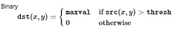

# Gesture Recognition

## Points to note along the way:

### a) `segment.py`

1. [Gaussian Blur - basics](https://datacarpentry.org/image-processing/06-blurring/#gaussian-blur)

2. Understanding cv2.threshold

>def threshold(source, thresholdValue, maxVal, thresholdingTechnique)

3. Understanding cv2.findContours

>def findContours(image, mode, method)

- Give the copy of the image as input(since it'll get changed)

- We have used cv2.RETR_EXTERNAL because it gives "outer" contours, so if you have (say) one contour enclosing another (like concentric circles), only the outermost is given.

- If you pass cv2.CHAIN_APPROX_NONE, all the boundary points are stored. But actually do we need all the points? For eg, you found the contour of a straight line. Do you need all the points on the line to represent that line? No, we need just two end points of that line. This is what cv2.CHAIN_APPROX_SIMPLE does. It removes all redundant points and compresses the contour, thereby saving memory. ([See Documentation](https://opencv-python-tutroals.readthedocs.io/en/latest/py_tutorials/py_imgproc/py_contours/py_contours_begin/py_contours_begin.html#contour-approximation-method))

4. Based on the returned contour points we'll plot them in red in the original frame with the ROI as a green rectangle using cv2.drawContours and cv2.rectangle respectively.

(For knowing the working principle of the read the blog post by the author Gogul.)